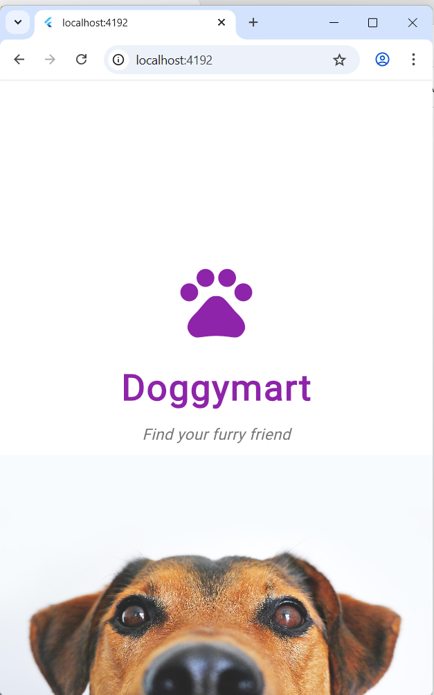
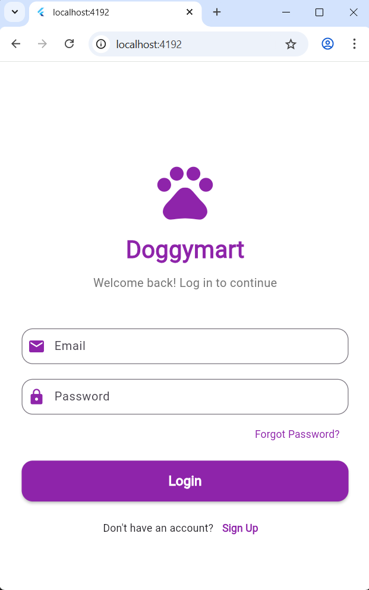
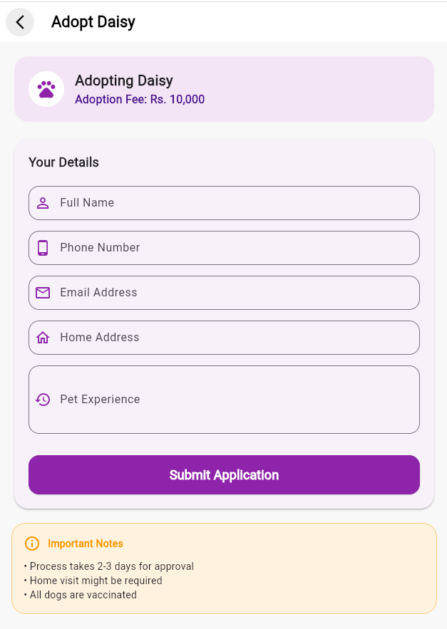

# 🐕 Doggymart - Pet Adoption App

A beautiful and user-friendly Flutter application for dog adoption, where users can browse dogs, mark favorites, and submit adoption applications.


---

## 📱 About the App

**Doggymart** is a mobile and web application that connects potential pet owners with dogs looking for forever homes. Users can browse through various dogs, view detailed information, save favorites, and submit adoption applications.

---

## ✨ Features

### 🔐 Authentication
- Splash screen with smooth animation
- Welcome page introduction
- Login page with email/password
- Logout with confirmation dialog

### 🏠 Home Page
- Browse dogs in a 2-column grid layout
- Welcome card with inspirational quote
- Dog cards with:
  - Dog image
  - Name and gender
  - Price
  - Favorite heart icon
  - "Adopt Me" button

### 📄 Dog Details
- Large dog image display
- Complete dog information
- Age, location, vaccination status
- "Start Adoption Process" button
- "Contact Seller" button

### 📝 Adoption Registration
- Comprehensive adoption form
- Fields for name, phone, email, address
- Previous pet experience section
- Success confirmation dialog

### ❤️ Favorites
- Save favorite dogs
- View all saved favorites
- Quick navigation to dog details

### 👤 Profile Management
- Profile image and personal information
- Adoption statistics (Adopted, Favorites, Pending)
- Menu options:
  - Adoption History
  - My Favorites
  - Settings
  - About Doggymart
  - Logout

### ⚙️ Settings
- Dark mode toggle
- Push notifications toggle
- Sound effects toggle
- Clear cache option
- Privacy policy and terms links

### 📞 Contact Support
- Contact information (phone, email, location)
- Business hours
- Contact form for messages
- Success message on submission

### 📖 About Page
- App logo and version
- Mission and vision statements
- Key features list
- Developer information

---

## 🛠️ Tech Stack

| Layer | Technology |
|-------|------------|
| **Frontend** | Flutter |
| **Language** | Dart |
| **State Management** | setState() with StatefulWidget |
| **Assets** | Local Images |

---

## 📸 Screenshots
 
| Splash Screen | Welcome Page |
|---------------|--------------|
|  |  |
 
| Login Page | Home Page |
|------------|-----------|
|  |  |
 
| Dog Details | Adoption Form |
|-------------|---------------|
|  |  |
 
| Favorites | Contact |
|-----------|---------|
|  |  |
 
| Profile |
|---------|
|  |
 
---

## 📂 Project Structure

```
lib/
├── main.dart                      # App entry point
├── splash_screen.dart             # Loading screen
├── welcome_page.dart              # Welcome/intro screen
├── login_page.dart                # Login screen
├── home_page.dart                 # Main dashboard
├── dog_details_page.dart          # Dog details view
├── adoption_registration_page.dart # Adoption form
├── favorites_page.dart            # Saved favorites
├── contact_page.dart              # Contact & support
├── profile_page.dart              # User profile
├── settings_page.dart             # App settings
└── about_page.dart                # App information
```

---

## 🎨 App Screens

| Screen | Description |
|--------|-------------|
| Splash Screen | App logo with loading animation |
| Welcome Page | Introduction to Doggymart |
| Login Page | User authentication |
| Home Page | Browse all dogs |
| Dog Details | Detailed dog information |
| Adoption Form | Apply for adoption |
| Favorites | Saved favorite dogs |
| Contact | Support and contact form |
| Profile | User profile and settings |
| Settings | App preferences |
| About | App information |

---

## 📱 App Flow

```
Splash Screen
    ↓
Welcome Page
    ↓
Login Page
    ↓
Home Page
    ├──→ Dog Details → Adoption Form
    ├──→ Favorites → Dog Details
    ├──→ Contact
    └──→ Profile
              ├──→ Settings
              └──→ About
```

---

## 🚀 Getting Started

### Prerequisites
- Flutter SDK (latest version)
- Android Studio / VS Code
- Android Emulator / Chrome browser

### Installation

1. **Clone the repository**
```bash
git clone https://github.com/lakshima045/dogger_mart_app.git
cd doggymart
```

2. **Install dependencies**
```bash
flutter pub get
```

3. **Run the app**
```bash
# For web
flutter run -d chrome

# For Android
flutter run -d android

# For iOS (Mac only)
flutter run -d ios
```

## 📱 Responsive Design

The app is designed to work on:
- **Android Phones** (All screen sizes)
- **Web Browsers** (Chrome, Firefox, Edge)
- **iOS** (With proper setup)

---

## 🔧 Future Improvements

- [ ] Firebase authentication (Google Sign-In)
- [ ] Real-time database for dog listings
- [ ] Image upload for dog listings
- [ ] User profiles with adoption history
- [ ] Chat feature between buyers and sellers
- [ ] Push notifications for application status
- [ ] Payment integration for adoption fees
- [ ] Search and filter functionality
- [ ] User reviews and ratings
- [ ] Social media sharing

---

## 👩‍💻 Authors

**Dhananji Lakshima**

**Pabodha Sewwandi**

⭐ *Feel free to explore, fork, or suggest improvements!*

---

**Made with ❤️ for dog lovers everywhere** 🐕💚
